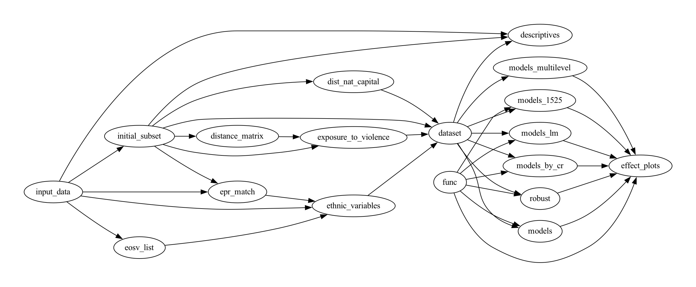

### README

**Replication files** for [Francisco Villamil](https://franvillamil.github.io/) (2023) '[Civilian victimization and ethnic attitudes in Africa](https://doi.org/10.1017/S1755773923000097)'. *European Political Science Review* 15(4): 617-627.

> **Abstract:** Previous research shows that violence is an important factor driving ethnic identification and grievances, but most works that explore micro-level effects focus on specific cases and have limited external validity. This article looks at the individual-level consequences of civilian victimization in a large sample across Africa. Combining georeferenced survey data from several rounds of the Afrobarometer, victimization events from the UCDP-GED, and data on collective targeting from the EOSV dataset, it studies the effect of exposure to violence on ethnic identification and self-reported ethnic grievances. Results show that violence increases ethnic identification and ethnic grievances particularly when it is committed by state forces and among individuals who belong to an ethnic group that was collective targeted in the past.

[Article (PDF)](https://www.cambridge.org/core/services/aop-cambridge-core/content/view/973528557583A9CB9A401109A6F15C20/S1755773923000097a.pdf/civilian-victimization-and-ethnic-attitudes-in-africa.pdf) / [Google Scholar page](https://scholar.google.com/citations?view_op=view_citation&hl=en&user=G10YqfQAAAAJ&citation_for_view=G10YqfQAAAAJ:WF5omc3nYNoC)

```
@article{Villamil2023,
	author = {Villamil, Francisco},
	journal = {European Political Science Review},
	volume = {15},
	number = {4},
	pages = {617--627},
	title = {Civilian victimization and ethnic attitudes in {A}frica},
	year = {2023}}
```

### Instructions

The code in this repository is organized in tasks, each in one folder. In order to replicate the results, run the following scripts (the final dataset can be found in `dataset/output/data.csv`):

  * `models/glm.R` produces the results in the main text
  * `effect_plots/effect_plots.R` creates the graphs showing the main effects

  * `models_1525/glm_1525.R` runs the models using the early adulthood measure
  * `robust/rob.R` runs a series of robustness tests
  * `models_by_cr/m_cr.R` runs the results disaggregating by country-round
  * `models_lm/lm.R` replicates the analyses using continuous outcomes
  * `models_multilevel/ mlm.R` replicates the analyses using multi-level models

The file `short_replication.zip` includes all the necessary files for this replication.

Alternatively, from the command line (Unix/macOS), you can do a full replication (including the preparation of the dataset) using `make`. If you want to remove all output files first and run it from scratch, run `make clean` followed by `make` (`R`, `git` and `pdfcrop` need be installed). *Note* the full process involves more intense computing and might take some time.

To download the repository and do a full replication automatically:

```shell
git clone https://github.com/franvillamil/ethnicity_africa
cd ethnicity_africa
rm -fv */*.Rout
make
```


